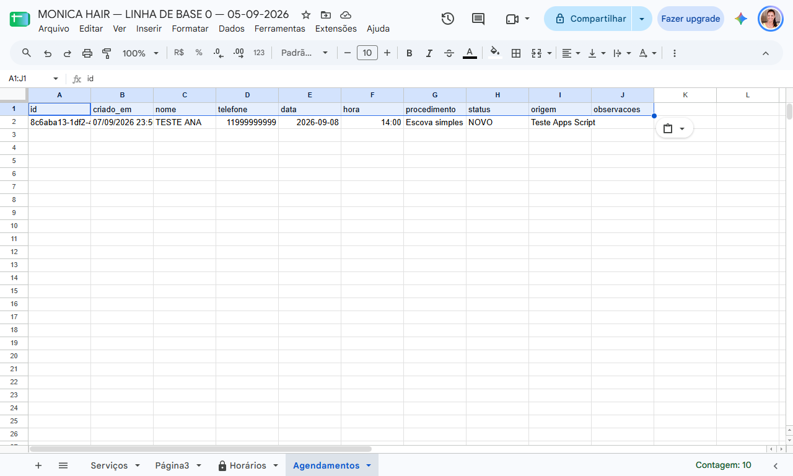

# Evidência E-002 — Teste real do doPost()

## Identificação
- Projeto: Hair by Monica — Appointment Management System
- Componente: Google Apps Script → Google Sheets
- Data do teste: 08/09/2026
- Função executada: `testeLocal()`
- Objetivo: validar o processamento real do `doPost()` com horário disponível.

## Pré-condição
Slot previamente disponibilizado em `Horários`:
`08/09/2026 | 15h00 | SIM`

## Resultado da execução
```json
{
  "success": true,
  "message": "Agendamento registrado com sucesso.",
  "id": "b7ce15ae-0955-4c2f-ba47-7550eaf195e4"
}
```

## Persistência observada

### Agendamentos
- nome: `Teste Ana`
- telefone: `11970164186`
- data: `2026-09-08`
- hora: `15:00`
- procedimento: `Escova simples`
- status: `NOVO`
- origem: `Landing Page Monica Hair`
- observacoes: `Teste local pelo Apps Script`

### Horários
`08/09/2026 | 15h00 | NÃO | Teste Ana | 11970164186 | NÃO`

## Critério de aceite
**APROVADO** — o `doPost()` processou um agendamento válido, persistiu o registro em `Agendamentos` e atualizou o respectivo slot em `Horários`.

## Ainda não comprovado
- deployment da Web App;
- comunicação real Landing Page → Web App;
- CORS;
- teste pelo formulário publicado.

## Evidência visual

