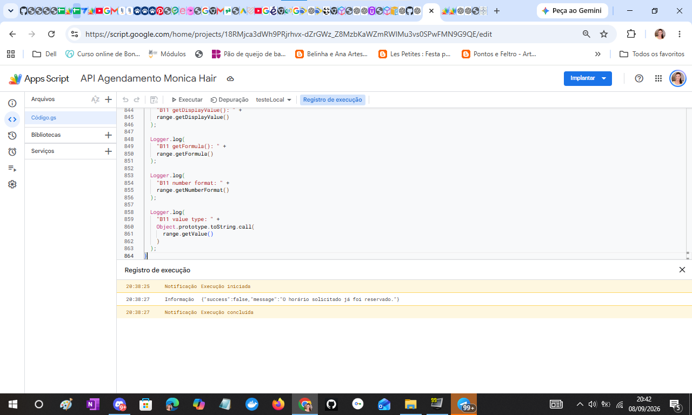

# Evidência E-003 — Prevenção de duplicidade de agendamento

## Identificação
- Projeto: Hair by Monica — Appointment Management System
- Componente: Google Apps Script → regra de negócio
- Data do teste: 08/09/2026
- Função executada: `testeLocal()`
- Objetivo: validar que uma segunda tentativa para o mesmo horário reservado é rejeitada.

## Pré-condição
O horário já estava reservado:
`08/09/2026 | 15h00 | NÃO | Teste Ana | 11970164186 | NÃO`

## Resultado da execução
```json
{
  "success": false,
  "message": "O horário solicitado já foi reservado."
}
```

## Critério de aceite
**APROVADO** — a segunda tentativa foi rejeitada e não foi aceito um novo agendamento para o horário já reservado.

## Regra comprovada
```text
1ª tentativa → 15:00 disponível → agendamento criado → slot NÃO disponível
2ª tentativa → 15:00 já reservado → success=false → novo agendamento rejeitado
```

## Observação
Este teste comprova a proteção do horário já ocupado. O código também contém uma verificação explícita de duplicidade por data e hora; este teste específico valida a rejeição no estado já reservado.

## Ainda não comprovado
- deployment da Web App;
- comunicação real Landing Page → Web App;
- CORS;
- teste pelo formulário publicado.

## Evidência visual

